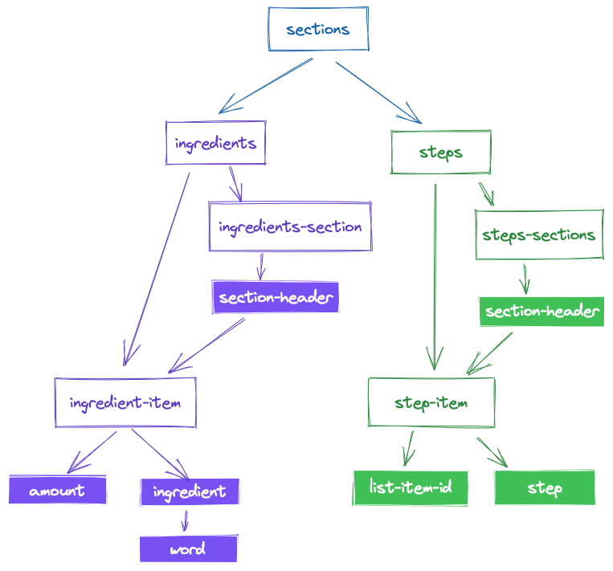

# recipe parser

> This is work in progress.

A shout-out to the awesome libraries the recipe parser relies on

1. [chevrotain](https://chevrotain.io/docs/) for lexing, parsing, and semantics.
2. [natural](https://github.com/NaturalNode/natural) for pluralization and phonetics.
3. [XRegExp](https://github.com/slevithan/xregexp) for sanity using regular expressions.

This recipe parser currently parses lists of ingredients, with optional sections, into a JSON object. For example, the following code

```typescript
const {recipe, errors} = toRecipe(`dough
        1 1/2 cp all-purpose flour
        1 tsp vanilla extract,
        sauce
        1 cup milk
        1 egg`
)
```

will parse

```text
dough
1 1/2 cp all-purpose flour
1 tsp vanilla extract,
sauce
1 cup milk
1 egg
```

into a JSON object

```json
{
  "type": "ingredients",
  "ingredients": [
    {
      "amount": {
        "quantity": 1.5,
        "unit": "cup"
      },
      "ingredient": "all-purpose flour",
      "section": "dough"
    },
    {
      "amount": {
        "quantity": 1,
        "unit": "tsp"
      },
      "ingredient": "vanilla extract",
      "section": "dough"
    },
    {
      "amount": {
        "quantity": 1,
        "unit": "cup"
      },
      "ingredient": "milk",
      "section": "sauce"
    },
    {
      "amount": {
        "quantity": 1,
        "unit": "piece"
      },
      "ingredient": "egg",
      "section": "sauce"
    }
  ]
}
```

The code for the previous example is

```typescript
it("should be parse a recipe into json", () => {
    const input = `dough
1 1/2 cp all-purpose flour
1 tsp vanilla extract,
sauce
1 cup milk
1 egg`

    const {recipe, errors} = toRecipe(input)
    expect(true).toBeTruthy()
    expect(recipe).toEqual({
        type: "ingredients",
        ingredients: [
            {
                amount: {quantity: 1.5, unit: UnitType.CUP},
                ingredient: 'all-purpose flour',
                section: 'dough'
            },
            {
                amount: {quantity: 1, unit: UnitType.TEASPOON},
                ingredient: 'vanilla extract',
                section: 'dough'
            },
            {
                amount: {quantity: 1, unit: UnitType.CUP},
                ingredient: 'milk',
                section: 'sauce'
            },
            {
                amount: {quantity: 1, unit: UnitType.PIECE},
                ingredient: 'egg',
                section: 'sauce'
            },
        ]
    })
    expect(errors).toHaveLength(1)
    expect(errors[0]).toEqual({
        offset: 54,
        line: 2,
        column: 22,
        length: 1,
        message: "unexpected character: ->,<- at offset: 54, skipped 1 characters."
    })
    expect(input[54]).toBe(',')
})
```

## the grammar

In order for a recipe's ingredients to be parsed, then must adhere to the following grammar, which uses the
[Augmented Backus-Naur Form (ABNF)](https://en.wikipedia.org/wiki/Augmented_Backus–Naur_form)
notation ([see this nice article](https://matt.might.net/articles/grammars-bnf-ebnf/)) for an introduction to grammar
notations.

```
// an ingredient list has either sections or ingredient itmes or both
ingredients = *[section] *[ingredient_item]

// a section has a header and a list of ingredient items
section = section_header 1*ingredient_item

// a section header must be on its own line, or surrounded by "#" or some
// combination of thos
section_header = (newline / "#") 1*word (*["#"] / newline)

// an ingredient item has an optional list ID, an amount, and an ingredient
ingredient_item = [ingredient_item_id 1*whitespace] amount ingredient

// an ingredient item ID is a list item, for example "1.", "*", "-", "•", "1)", etc
ingredient_item_id = ( [ "(" ] number [ "." / ")" / ":" ] ) / ( [ "-" / "*" / "•" ])

// the amount is a quantity and an optional unit (when no unit is present, will be
// treated as pieces, such as "1 egg" would become "1 piece egg")
amount = quantity [white_space] [unit]

// the ingredient (e.g. egg, all-purpose flour, etc) is a sequence of words that
// ends in a newline
ingredient = *word newline

// the quantity is a number or a fraction. A fraction can be expressed as a whole
// number and a fractional part (e.g. 1 1/4) or as a whole number and a unicode
// fraction
quantity = number / fraction

// units can be abbreviated, can be synonyms, plural...see the "unitMatcher(..)" function
// in the RecipeLexer.ts file for more details
unit = (mg / g / kg / oz / lb / ml / l / tsp / tbsp/ fl oz / cup / pt / qt / gallon /)["."]

// a word
word = 1*("\w" / "." / "'" / "(" / ")" / "[" / "]" / "{" / "}" / "-")

number = integer / decimal / (integer unicode_fraction)
integer = 0 / (natural_digit *digit)
decimal = integer "." 1*digit
fraction = integer "/" natural_digit *digit
natural_digit = 1 / 2 / 3 / 4 / 5 / 6 / 7 / 8 / 9
digit = 0 / natural_digit
unicode_fraction = \u00BC | \u00BD | \u00BE | ...

newline = "\n" / "\r\n"
white_space = *( " " / "\t" )
```

Recipes using this grammar get parsed into the following syntax tree structure.



